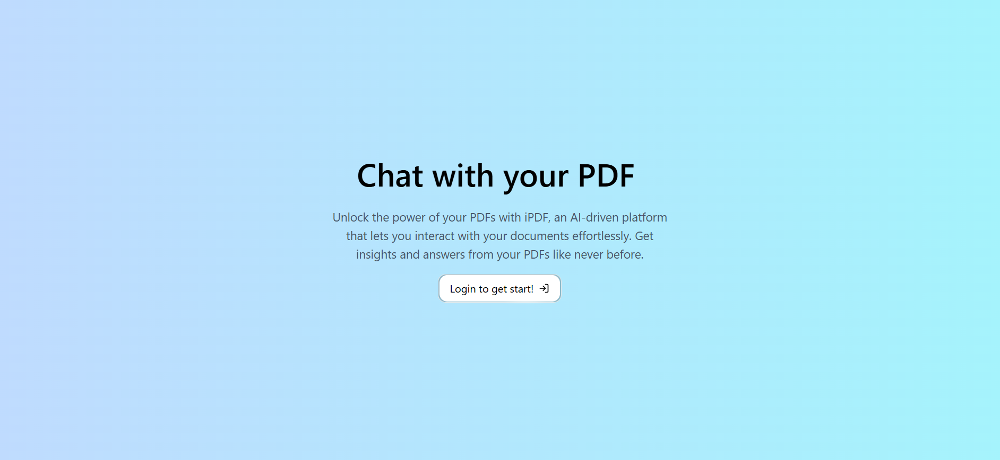
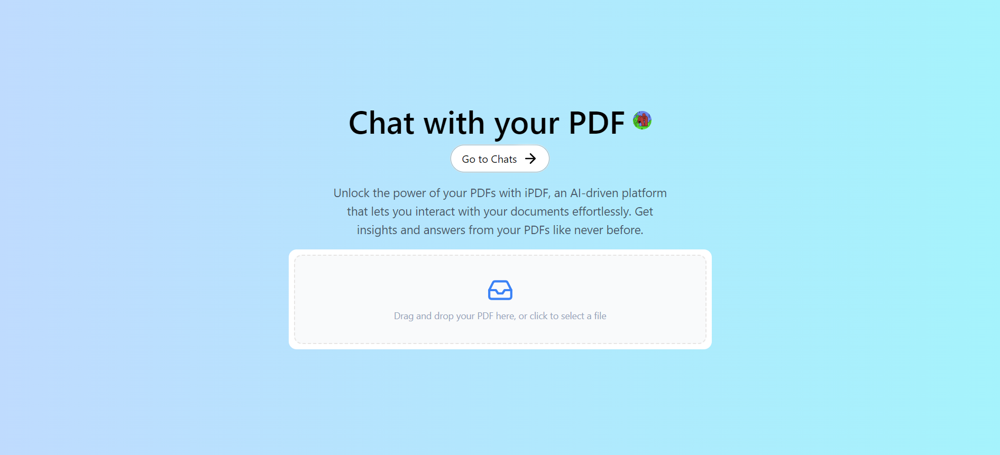
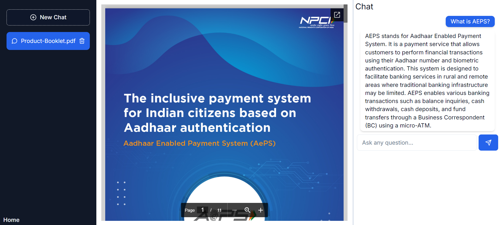

# iPDF: Unlock the Power of Your PDFs with AI-Driven Insights.
Live: https://ipdf-jeesun.vercel.app/

**iPDF** is a cutting-edge SaaS platform that redefines PDF document interaction. By harnessing the power of artificial intelligence, it offers a streamlined process for uploading, analyzing, and engaging with PDF content. The platform's AI-driven chatbot provides real-time, intelligent answers to user queries about PDF content, delivering valuable insights.

## Features

- **PDF Upload**: Users can upload PDF documents to the platform.
- **AI Chatbot**: Interact with PDF content through a natural language interface. The AI chatbot answers questions about the PDF's contents using advanced natural language processing (NLP) and vector embeddings to ensure precise and relevant responses.
- **Real-Time Interaction**: Engage with your documents like never before with real-time responses from the AI chatbot.
- **Responsive Design**: The platform is designed with Tailwind CSS, ensuring a responsive and user-friendly interface across devices.

## Technologies Used

iPDF is built using a modern technology to ensure performance, and ease of use.

- **Next.js**: A React-based framework used for building the user interface and handling server-side rendering.
- **TypeScript**: Ensures type safety and enhances the development experience with static typing.
- **Tailwind CSS & Shadcn**: Utility-first CSS frameworks for building custom designs directly in the HTML, providing a consistent and responsive UI.
- **Next.js API Routes**: Used for handling backend logic and API requests within the Next.js framework.
- **OpenAI API & Vercel AI SDK**: Integration with OpenAI's powerful language models to provide intelligent chatbot responses.
- **Langchain**: Facilitates the chaining of language model responses to provide contextual and accurate results.
- **Pinecone**: Handles vector embedding and similarity search for efficient document querying.
- **AWS S3**: Used for secure and scalable storage of uploaded PDFs.
- **Neon DB & Drizzle ORM**: A modern PostgreSQL database with Drizzle ORM for structured and efficient data management.
- **Clerk Authentication**: User authentication, including sign-up and sign-in, is securely managed by Clerk.

## Usage

1. **Sign Up**: Create an account and log in.
2. **Upload a PDF**: Navigate to the upload section and choose a PDF file to upload.
3. **Ask Questions**: Once the PDF is processed, use the AI chatbot to ask questions about the document's content.

